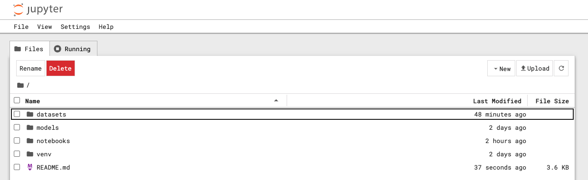
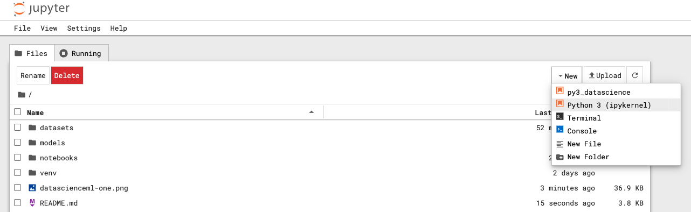

# Data Scinece and Machine Learning Using Python, Scikit-Learn

## Setting up environment

1. Download and install Python from https://www.python.org/downloads/
2. After installing Python successfully, you can check by running `python --version`
3. Create project folder with name `datascience-ml` (can be used any name)
4. Inside `datascience-ml` folder, create 3 subfolders with name `notebooks`, `datasets` and `models`
5. Create a Python virtual environment using `python3 -m venv venv`
6. Once the virtual environment is created, we can activate by running below commands
    **Windows** : `.\venv\Script\activate`
    **MacOS**: `./venv/bin/activate`
    **Linux**: `./venv/bin/activate`
7. Install the packages to get started with data-science and ML
   `pip install jupyter`
   `pip install seaborn`
   `pip install scikit-learn`
8. Navigate to `datascience-ml` folder and intialize the repository as **git** repository using `git init` command
9. Add below file to git respository `datascience-ml`
    `touch .gitignore`
    `touch .gitkeep`
    `touch README.md`
10. Add below content to **.gitignore**
```
# Created by https://www.toptal.com/developers/gitignore/api/python,jupyternotebooks
# Edit at https://www.toptal.com/developers/gitignore?templates=python,jupyternotebooks

### JupyterNotebooks ###
# gitignore template for Jupyter Notebooks
# website: http://jupyter.org/

.ipynb_checkpoints
*/.ipynb_checkpoints/*

# IPython
profile_default/
ipython_config.py

# Remove previous ipynb_checkpoints
#   git rm -r .ipynb_checkpoints/

### Python ###
# Byte-compiled / optimized / DLL files
__pycache__/
*.py[cod]
*$py.class

# C extensions
*.so

# Distribution / packaging
.Python
build/
develop-eggs/
dist/
downloads/
eggs/
.eggs/
lib/
lib64/
parts/
sdist/
var/
wheels/
share/python-wheels/
*.egg-info/
.installed.cfg
*.egg
MANIFEST

*.manifest
*.spec

# Installer logs
pip-log.txt
pip-delete-this-directory.txt

# Unit test / coverage reports
htmlcov/
.tox/
.nox/
.coverage
.coverage.*
.cache
nosetests.xml
coverage.xml
*.cover
*.py,cover
.hypothesis/
.pytest_cache/
cover/

# Translations
*.mo
*.pot

# Django stuff:
*.log
local_settings.py
db.sqlite3
db.sqlite3-journal

# Flask stuff:
instance/
.webassets-cache

# Scrapy stuff:
.scrapy

# Sphinx documentation
docs/_build/

# PyBuilder
.pybuilder/
target/

# Jupyter Notebook

# IPython

# Celery stuff
celerybeat-schedule
celerybeat.pid

# SageMath parsed files
*.sage.py

# Environments
.env
.venv
env/
venv/
ENV/
env.bak/
venv.bak/

# Spyder project settings
.spyderproject
.spyproject

# Rope project settings
.ropeproject

# mkdocs documentation
/site

# mypy
.mypy_cache/
.dmypy.json
dmypy.json

# Pyre type checker
.pyre/

# pytype static type analyzer
.pytype/

# Cython debug symbols
cython_debug/

# ruff
.ruff_cache/

# LSP config files
pyrightconfig.json

# End of https://www.toptal.com/developers/gitignore/api/python,jupyternotebooks
```

## Data Science and Machine Learning Overview

1. Open terminal/command prompt and navigate to git repository that you have created above `datascience-ml`
2. Launch Jupyter notebook by running `jupyter notebook` and you will see below response on terminal
```bash
To access the server, open this file in a browser:
file:///Users/gaurnitai/Library/Jupyter/runtime/jpserver-49646-open.html
Or copy and paste one of these URLs:
http://localhost:8888/tree?token=2cd12a551d176db9cdda632a9a4a837feb7be6d2b0f995f8
http://127.0.0.1:8888/tree?token=2cd12a551d176db9cdda632a9a4a837feb7be6d2b0f995f8
```
3. Open the above link http://localhost:8888/tree?token=2cd12a551d176db9cdda632a9a4a837feb7be6d2b0f995f8 in any of the browser of yours choice
4. You will see a webpage get open as below:
   
5. Open **notebooks** folder and run any of the file with extension **.ipynb** i.e. notebook
6. To create new notebook, you can click on **New** > **Python 3 (Kernel)**
   

Now you are good to get started with data science and Machine learning code using **Python, scikit-learn, pandas, numpy, seaborn** and **matplotlib**
